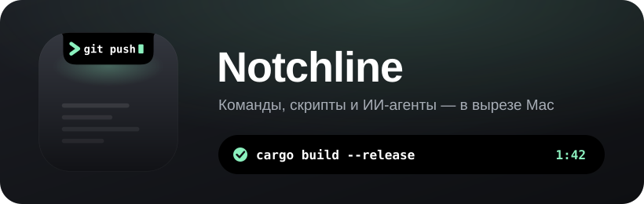

<div align="center">



**Долгие команды, скрипты и ИИ-агенты — прямо в вырезе Mac**

[](https://github.com/PinkmanXXX/Notchline/releases/latest/download/Notchline.dmg)
[](#установка)
[](#установка)

<a href="https://github.com/PinkmanXXX/Notchline/releases/latest/download/Notchline.dmg"></a>

[Скачать](#установка) · [Возможности](#возможности) · [Агенты](#ии-агенты) · [Prod Guard](#prod-guard) · [notch для скриптов](#notch-для-скриптов) · [Поддержать](#поддержать-проект)

</div>

---

Запустили сборку, деплой или агента — и ушли в браузер. Notchline показывает в
вырезе экрана, что сейчас идёт и сколько уже длится, а когда всё закончится —
скажет об этом зелёным или красным. Клик по строке вернёт в ту вкладку
терминала, где шла команда.

<div align="center">

</div>

## Установка

1. Скачайте `Notchline.dmg` кнопкой в начале страницы, откройте его и перетащите
   Notchline в «Программы».
2. Запустите Notchline. Сборка не подписана сертификатом Apple, поэтому при
   первом запуске macOS спросит, доверяете ли вы ей: откройте **Системные
   настройки → Конфиденциальность и безопасность**, внизу нажмите
   **«Всё равно открыть»** и подтвердите.
3. В строке меню появится значок терминала: **Настройки… → Терминал →
   Установить для zsh**. Откройте новую вкладку терминала — готово.

Или одной командой в терминале, без шага 2:

```bash
curl -fsSL https://raw.githubusercontent.com/PinkmanXXX/Notchline/main/scripts/install.sh | bash
```

> [!NOTE]
> Notchline ничего не отправляет в интернет: он слушает только ваш терминал
> через локальный сокет, доступный одному вашему пользователю. Единственный
> запрос наружу — раз в час он смотрит на GitHub, не вышла ли новая версия;
> это отключается в «О программе».

## Возможности

- **Долгие команды.** Всё, что идёт дольше 3 секунд, появляется в вырезе
  с живым таймером; если команд несколько — `+N`. Короткие вроде `ls` остров не трогают
- **Готово или ошибка.** Команда дольше 10 секунд заканчивается тостом:
  зелёным, если всё хорошо, красным с кодом ошибки — если нет. По желанию со звуком
- **Обратно в терминал.** Клик по строке открывает ту самую вкладку в Terminal и
  iTerm2, а Ghostty, VS Code и остальные просто выходят на передний план
- **Настоящий вырез.** В покое остров размером с вырез MacBook Pro, а когда что-то
  происходит — плавно вырастает, как Dynamic Island. Размер и прозрачность настраиваются
- **История.** При наведении — что идёт сейчас и что недавно закончилось:
  папка, длительность, код выхода
- **Любой край.** Сверху, снизу или сбоку экрана, на одном мониторе или на всех
- **Уведомления по вкусу.** Отдельно включается, о чём сообщать: успех, ошибка, агент
  ждёт ответа, вход в прод, новая версия — тостом, звуком или в Центр уведомлений
- **Обновления.** Раз в час проверяет новую версию и предлагает её скачать
- **Три языка.** Русский, английский и китайский

## ИИ-агенты

Notchline показывает, чем заняты агенты: работают, ждут вашего ответа или
закончили. Запрос разрешения или вопрос подсвечивается янтарным и приходит
тостом — не нужно держать окно агента перед глазами.

<div align="center">

</div>

| Агент | Подключение | Что видно |
|---|---|---|
| Claude Code | кнопкой в настройках | работает · инструменты · ждёт вас · готово |
| Gemini CLI | кнопкой в настройках | работает · инструменты · ждёт вас · готово |
| GitHub Copilot в VS Code | кнопкой в настройках | работает · инструменты · готово |
| Cursor | кнопкой в настройках | инструменты · готово |
| Codex | строкой в `~/.codex/config.toml` | готово |
| Aider | строками в `~/.aider.conf.yml` | готово |

Всё подключается в **Настройки → Агенты**. Ваши собственные настройки агентов
остаются на месте, а рядом с изменённым файлом сохраняется копия.

## Prod Guard

Пока терминал, в котором вы работаете, смотрит в продакшен, вырез становится
красным — и остаётся на экране, даже если Notchline скрыт.

<div align="center">

</div>

Проверяются контекст Kubernetes, профиль AWS, проект Google Cloud, workspace
Terraform, контекст Docker и хост SSH. Что считать продом, задаётся словами —
по умолчанию `prod`, `production`, `prd`: `eks-prod-eu` сработает, а
`product-api` — нет.

## notch для скриптов

Любой скрипт может показать в вырезе свой прогресс:

```bash
notch start "Деплой"
notch progress 40
notch wait "Нужен код 2FA"     # янтарным, с тостом
notch done "Готово"            # или: notch fail "Откатились"
```

`notch run make release` оборачивает любую команду: показывает её, пока идёт, и
сообщает, чем закончилась. Если Notchline закрыт, `notch` ничего не делает и
никогда не ломает скрипт.

<div align="center">

</div>

## Для разработчиков

Swift и SwiftUI, без Xcode-проекта: всё собирается через Swift Package Manager и
`make`. Как устроены хук, сокет и Prod Guard, как собрать и как запустить тесты —
в [документации для разработки](docs/DEVELOPMENT.md).

```bash
make run     # собрать и запустить
make test    # юнит-тесты
make e2e     # сквозные тесты: настоящее приложение, zsh и notch
```

## Поддержать проект

Notchline бесплатный и таким останется: без рекламы, подписок и сбора данных.
Донат добровольный и ничего не открывает в приложении — он помогает делать
новое. Спасибо! 💜

| Способ | |
|---|---|
| Российской картой, СБП, Tinkoff Pay | [CloudTips](https://pay.cloudtips.ru/p/d4f9e3d1) |
| Зарубежной картой, Apple Pay, Google Pay | [Buy Me a Coffee](https://buymeacoffee.com/relo.cate) |
| USDT (TRC-20) | `TS83ViXrdezUpp1eFadqj1rBhGLZaba1c1` |
| TON | `UQBchO4XFPwF9MMa_tjXpwqTo8IL2FhUDyllhYuFo8WM-Qbf` |
| Ethereum (ERC-20) | `0xC06F6B3A029d7Ea00705B7028490744e2BC16799` |

## Лицензия

MIT — пользуйтесь, меняйте, делитесь.
