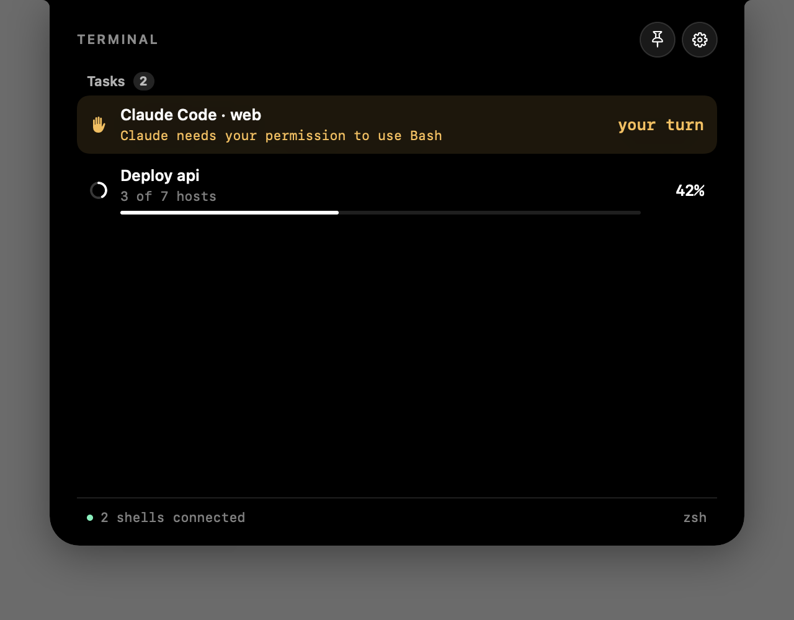
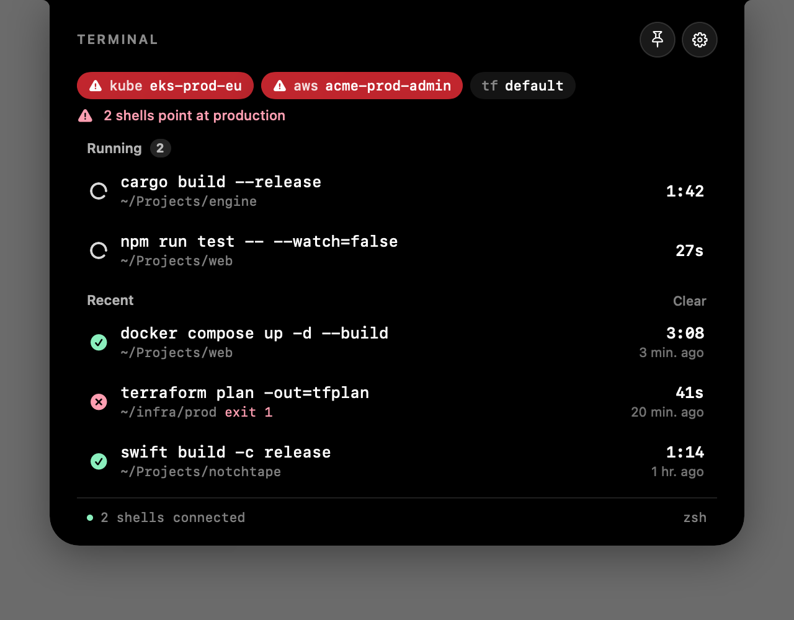

# Notchline — for developers

How the hook, the socket, the island and Prod Guard work, and how to build and test
it. For what the app does and where to download it, see the [project page](../README.md).


-6B45E8)


Long-running terminal commands, scripts and coding agents, in the notch — and a notch
that turns red when your shell points at production.

Start a build, switch to the browser, and the notch keeps counting. When it is done
it says so, green or red, and a click takes you back to the terminal it ran in.


> **v1.1.** Shell support is zsh only for now; bash and fish are next.

## The island

At rest it is a MacBook notch: black, flat against the top edge, rounded below, with
the small inward curves where it meets the bezel — 185 × 32 pt, the size of a
14-inch MacBook Pro notch. On a screen with a real notch it takes that notch's exact
size, so the two are one shape.


When something happens it grows, like the Dynamic Island: one spring animation of
its size, corners and content. Size (80–150 %) and background opacity are two
sliders in Settings → General.

## Long-running commands

| Where | What |
|---|---|
| The island | The newest command that has run longer than 3 s, with a live timer and `+N` for any others |
| Hover | Everything running and the latest finished commands, with directory, duration and exit code |
| When a command ends | A toast after 10 s or more, green for exit 0 and red otherwise, with an optional sound and system notification |
| Click | Switches to the exact tab in Terminal and iTerm2 (macOS asks once for permission); for Ghostty, VS Code and the rest, brings the app forward |

On a screen with a notch the command sits to the left of the camera and the timer to
the right.


Editors, pagers and sessions that run for as long as you use them — `vim`, `less`,
`ssh`, `tmux`, `claude` and a few more — are left out. The list is editable.

Recent commands are kept between launches in `history.json`, readable by you only;
Settings → Terminal turns that off.

## `notch` for scripts

Anything a script does can show in the island:

```bash
notch start "Deploy api"
notch progress 40
notch status "3 of 7 hosts"
notch wait "Needs the 2FA code"     # amber, with a toast: it cannot go on without you
notch done "All green"              # or: notch fail "Rolled back"
```


`notch run make release` wraps a command: it shows while it runs and ends in a green
or red toast, and exits with the command's own status. Every call from one script
updates the same task; `--id` names one explicitly.

`notch` ships inside the app, and the zsh hook puts it on `PATH`. Elsewhere, use
`~/Library/Application Support/Notchline/bin/notch`. With the app closed it does
nothing and never fails a script.

## Coding agents

Agents in the island: working, waiting for you, done. Settings → Agents connects them.


| Agent | How it is wired | What shows |
|---|---|---|
| Claude Code | hooks merged into `~/.claude/settings.json` | working · tool calls · waiting for you · done |
| Gemini CLI | hooks merged into `~/.gemini/settings.json` | working · tool calls · waiting for you · done |
| GitHub Copilot in VS Code | its own file, `~/.copilot/hooks/notchline.json` | working · tool calls · done |
| Cursor | non-blocking hooks in `~/.cursor/hooks.json` | tool calls · done |
| Codex | a line for `~/.codex/config.toml` | done |
| Aider | two lines for `~/.aider.conf.yml` | done |

Merged files keep everything else in them, and the first change leaves a
`.notchline-backup` copy beside the file. TOML and YAML are left for you to paste into.

Cursor gets only its non-blocking hooks: its blocking ones treat an empty answer as
"deny", and Notchline should never be able to allow or refuse anything an agent does.
For the same reason no hook answers with a decision: Claude's stays silent, the others
print `{}`.

**VS Code.** Its built-in terminal needs nothing: it runs your zsh with the hook, so
commands there show up like anywhere else. Its Copilot agent is the GitHub Copilot row.

**Anything else** that can run a command on an event:

```bash
notch start "My agent" --id my-agent
notch wait "Needs approval" --id my-agent
notch done --id my-agent
```

Agent turns do not go into the history; there are too many.



## Prod guard

While the shell you are typing in — or any shell that is running a command — points
at production, the island turns red and stays on screen, even in hidden mode.
Entering production is announced with a toast and a sound.


| Checked | Read from |
|---|---|
| Kubernetes context | `current-context` of your kubeconfig, `KUBECONFIG` lists respected |
| AWS profile | `AWS_PROFILE`, `AWS_VAULT` or `AWS_DEFAULT_PROFILE` |
| Google Cloud | the active gcloud configuration and its project |
| Terraform workspace | `TF_WORKSPACE` or `.terraform/environment` in the current folder |
| Docker context | `DOCKER_CONTEXT` or the current docker context |
| SSH host | the host of a running `ssh` or `mosh` |
| Folder path | the current directory — off by default |

What counts as production is a list of names, `prod, production, prd` to begin with.
A plain word has to match a whole part of the name, so `prod` catches `eks-prod-eu`
and `arn:…:cluster/prod` but not `product-api`; anything with `*` is a glob, such as
`*-live`.

The hover panel shows the current shell's environments, production ones in red.



## Connecting the shell

Settings → Terminal → **Install for zsh** appends one line to `~/.zshrc`:

```zsh
[[ -r "$HOME/Library/Application Support/Notchline/shell/notchline.zsh" ]] && source "$HOME/Library/Application Support/Notchline/shell/notchline.zsh"
```

Open a new terminal tab and it is live. The line does nothing once the app is gone,
and **Remove** takes it out again.

### How it works

The hook adds `preexec` and `precmd` functions that send short messages to a Unix
socket in `~/Library/Application Support/Notchline/notch.sock`: a command started, a
command ended, and on every prompt the shell's environment variables. `notch` talks to
the same socket. It uses zsh's
own `zsh/net/socket` module, so it costs no extra process, and when the app is not
running the hook finds no socket and returns.

The prompt never parses a file. The app reads kubeconfig, gcloud and docker state
itself, caches them by modification date, and re-checks every few seconds, so a
`kubectx` in another tab or a switch in Lens shows up too.

Nothing leaves your Mac. The socket and the history file are readable by your user
only.

## Placement

| Setting | Options |
|---|---|
| Show | While running · Always · Hidden until the cursor reaches the edge |
| Edge | Top · Right · Bottom · Left |
| Surface | Black, like the notch · System glass |
| Size | 80–150 % |
| Opacity | 20–100 % of the background; text stays solid |
| Displays | Main display · All displays |

A click on the closed island opens it pinned; the pin button in the panel pins and unpins it. A pinned panel stays open until it is unpinned, otherwise it closes when the cursor leaves or you click elsewhere.

## Building

```bash
make run        # universal release build, assembled into Notchline.app, launched
make test       # unit tests: the wire format, production matching, ssh and kubeconfig parsing
make e2e        # end to end: the real app, real zsh sessions and notch, in a throwaway home
make dmg        # the same app, packed into Notchline.dmg
```

`make e2e` runs the debug app with `NOTCHLINE_TEST_HOME` pointing at a temporary folder,
so it has its own socket, `.zshrc`, `.claude` and kubeconfig and never touches yours,
and drives it the way people do: zsh sessions with the hook, `notch`, Claude Code hook
events for every agent, kubeconfig and AWS profile switches, hover, pin and outside
clicks. Debug
builds answer a `dump` request on the socket with their state, which is what the tests
check.

`swift build` then `.build/debug/Notchline --snapshot <dir>` renders the island in
each of its states to PNG with sample data — handy when the screen itself cannot be
captured. `NOTCHLINE_TRACE=1 .build/debug/Notchline` prints every message it receives
and the state after it.

## Roadmap

- bash and fish hooks

## Licence

MIT.
